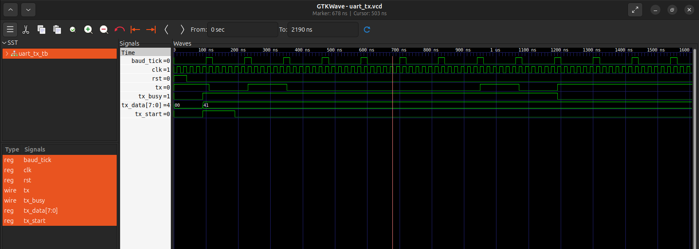

# UART Transmitter (Verilog HDL)

## Overview

This project implements an **8-bit UART (Universal Asynchronous Receiver/Transmitter) Transmitter** using **Verilog HDL**. The design follows the standard **8N1 UART protocol** (1 Start Bit, 8 Data Bits, No Parity, 1 Stop Bit).

The transmitter is implemented using a **Finite State Machine (FSM)** and verified using **Icarus Verilog** and **GTKWave**.

---

## Features

- 8-bit UART Transmission
- 8N1 UART Protocol
- FSM-based Design
- Synthesizable Verilog RTL
- Testbench for Functional Verification
- Waveform Verification using GTKWave

---

## Tools Used

- Verilog HDL
- Icarus Verilog
- GTKWave
- Ubuntu Linux
- Git & GitHub

---

## Project Structure

```
UART-Transmitter-Verilog/
│
├── rtl/
│   └── uart_tx.v
│
├── tb/
│   └── uart_tx_tb.v
│
├── waveform/
│   └── uart_tx_waveform.png
│
└── README.md
```

---

## FSM States

- IDLE
- START
- DATA
- STOP

---

## Simulation

Compile:

```bash
iverilog -o uart_sim rtl/uart_tx.v tb/uart_tx_tb.v
```

Run:

```bash
vvp uart_sim
```

Open waveform:

```bash
gtkwave uart_tx.vcd
```

---

## Waveform



---

## Author

**Akshith**
